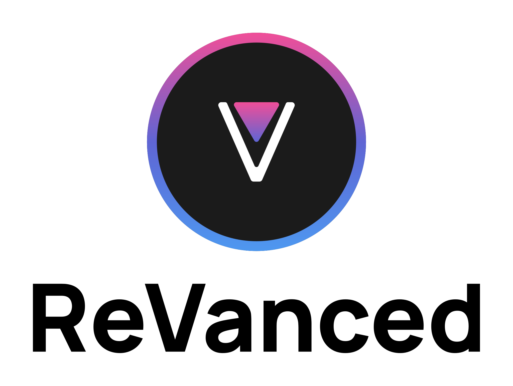

  <picture>
    <source
      width="256px"
      media="(prefers-color-scheme: dark)"
      srcset="assets/revanced-headline/revanced-headline-vertical-dark.svg"
    >
    
  </picture>
   
  <a href="https://revanced.app/">
       <picture>
           <source height="24px" media="(prefers-color-scheme: dark)" srcset="assets/revanced-logo/revanced-logo.svg" />
           
       </picture>
   </a>&nbsp;&nbsp;&nbsp;
   <a href="https://github.com/ReVanced">
       <picture>
           <source height="24px" media="(prefers-color-scheme: dark)" srcset="https://i.ibb.co/dMMmCrW/Git-Hub-Mark.png" />
           
       </picture>
   </a>&nbsp;&nbsp;&nbsp;
   <a href="http://revanced.app/discord">
       <picture>
           <source height="24px" media="(prefers-color-scheme: dark)" srcset="https://user-images.githubusercontent.com/13122796/178032563-d4e084b7-244e-4358-af50-26bde6dd4996.png" />
           
       </picture>
   </a>&nbsp;&nbsp;&nbsp;
   <a href="https://reddit.com/r/revancedapp">
       <picture>
           <source height="24px" media="(prefers-color-scheme: dark)" srcset="https://user-images.githubusercontent.com/13122796/178032351-9d9d5619-8ef7-470a-9eec-2744ece54553.png" />
           
       </picture>
   </a>&nbsp;&nbsp;&nbsp;
   <a href="https://t.me/app_revanced">
      <picture>
         <source height="24px" media="(prefers-color-scheme: dark)" srcset="https://user-images.githubusercontent.com/13122796/178032213-faf25ab8-0bc3-4a94-a730-b524c96df124.png" />
         
      </picture>
   </a>&nbsp;&nbsp;&nbsp;
   <a href="https://x.com/revancedapp">
      <picture>
         <source media="(prefers-color-scheme: dark)" srcset="https://user-images.githubusercontent.com/93124920/270180600-7c1b38bf-889b-4d68-bd5e-b9d86f91421a.png">
         
      </picture>
   </a>&nbsp;&nbsp;&nbsp;
   <a href="https://www.youtube.com/@ReVanced">
      <picture>
         <source height="24px" media="(prefers-color-scheme: dark)" srcset="https://user-images.githubusercontent.com/13122796/178032714-c51c7492-0666-44ac-99c2-f003a695ab50.png" />
         
     </picture>
   </a>
    
    
   Continuing the legacy of Vanced

# 💊 Universal ReVanced Manager

Application to use ReVanced on Android

## ❓ About

Universal ReVanced Manager is an application that uses [ReVanced Patcher](https://github.com/revanced/revanced-patcher) to patch Android apps.

## 💪 Unique Features

The unique features Universal ReVanced Manager provides that the official ReVanced Manager doesn't are:

- 💉 **Third Party Patch Support**: Import any third party patch bundle of your choice (such as inotia00's or anddea's which the official ReVanced Manager doesn't support)
- 🛠️ **Additional Customization**: Apply a display name of your choice to any of your imported patch bundles
- 🙂**Quality Of Life**: A button to deselect all patches in selection menu
And more..

## 🔽 Download

You can download the most recent version of ReVanced Manager from [GitHub releases](https://github.com/Jman-Github/universal-revanced-manager/releases/latest).

## 📋 Patch Bundles

To import patch bundles into Universal ReVanced Manager, use my [ReVanced Patch Bundles](https://github.com/Jman-Github/ReVanced-Patch-Bundles) repository. It includes a detailed [catalog](https://github.com/Jman-Github/ReVanced-Patch-Bundles/blob/bundles/patch-bundles/PATCH-LIST-CATALOG.md) of all patches across 20+ tracked bundles, as well as [bundle URLs](https://github.com/Jman-Github/ReVanced-Patch-Bundles#-patch-bundles-urls) you can paste directly into Universal ReVanced Manager to import them. Keep in mind that only the patch bundles labeled "API v4" can be imported into the manager. Bundles without this label cannot be imported into the app.

## ⚖️ License

Universal ReVanced Manager is licensed under the GPLv3 license. Please see the [license file](https://github.com/Jman-Github/universal-revanced-manager/blob/main/LICENSE) for more information.
[tl;dr](https://www.tldrlegal.com/license/gnu-general-public-license-v3-gpl-3) you may copy, distribute and modify Universal ReVanced Manager as long as you track changes/dates in source files.
Any modifications to Universal ReVanced Manager must also be made available under the GPL, along with build & install instructions.
